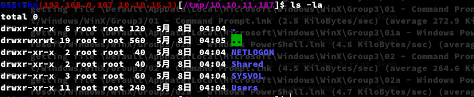

# SMB-Downloader

SMB-Downloader is a simple Bash script that automates the process of downloading files from shared directories over SMB/CIFS protocol. The tool is designed to interact with remote SMB shares and download their contents to a local directory.

## Features

- **Download from Multiple SMB Shares**: Supports multiple share directories, specified by the user, and downloads their contents.
- **Colorful Output**: Uses color-coded terminal output to provide clear information about the download process.
- **Pre-check for smbclient**: Ensures that `smbclient` is installed before execution, preventing errors if the tool is missing.
- **User-friendly**: Simple to use with a clear usage message when arguments are incorrect.

## Requirements

`$ apt install smbclient`

## Usage

`$ ./smbd.sh`

`$ ./smbd.sh 10.10.11.187 svc_apache 'S@Ss!K@*t13' NETLOGON,Shared,SYSVOL,Users,Web` 

`/tmp/10.10.11.187`

